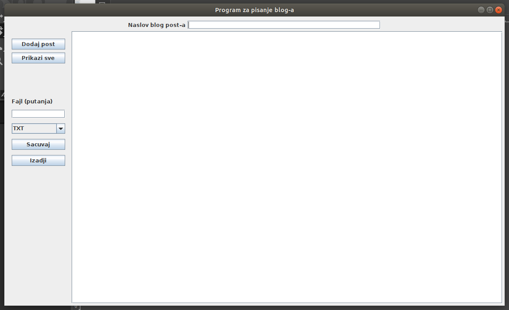
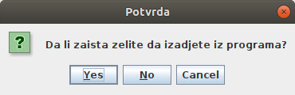
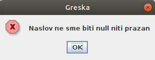

# Predavanje 13

	14 Grafičku (korisnički) interfejsi u Javi

# Zadatak 1

Iskoristiti klase **Blog** i **BlogPost** iz paketa **dvocas11.zadatak1** kao klase koje predstavljaju poslovnu logiku nove aplikacije za pisanje bloga. Iskopirati ih u paket **dvocas13.zadatak1.poslovna_logika**. **(podsetiti se šta ove klase rade i koje imaju metode)**

**Problem:** Ovi podaci iz bloga su sačuvani u tekstualnom i binarnom formatu. Da li može da se sačuva u nekom formatu koji podržava razmenu podataka između različitih platformi i sistema? **([JSON format ukratko -  W3 Schools tutorijel](https://www.w3schools.com/js/js_json_intro.asp), ideja i izgled)**

Izmeniti kod klase **BlogPost** odnosno metoda **setNaslov** i **setSadrzaj** tako da bacaju izuzetke i ako je naslov odnosno sadržaj prazan String. 

Izmeniti kod klase **Blog** tj. dodati u nju:

- javnu metodu **getPostovi** koja vraća listu sa svim blog postovima iz bloga.

- javnu metodu **sacuvajBlogJSON** koja kao parametar dobija putanju do JSON fajla i u taj fajl
upisuje sav sadržaj svih postova iz blog-a.**(Korišćenje eksterne JAR fajlova i eksternih Java
biblioteka - GSON, pronalaženje, uključivanje u projekat u lib folder, povezivanje sa projektom,
klase Gson i GsonBuilder)**

Napraviti javnu klasu **BlogGUI** u paketu **dvocas13.zadatak1.gui** koja izgleda kao na slici levo,
a kada se dimenzije ovog prozora promene, kao na slici desno. Padajuća lista bi trebalo da sadrži
stavke TXT, BINARNI i JSON.**(Layout Manager klase i njihova svrha, GridLayout, FlowLayout i BorderLayout)**

Klasa **BlogGUI** bi trebalo da ima: 

- privatni atribut **blog** koji predstavlja objekat klase Blog. Inicijalizovati ovaj atribut
(napraviti instancu klase Blog) u konstruktoru klase BlogGUI.

- kada se klikne na dugme **Prikazi sve**, potrebno je prikazati sve podatke o svim
blog postovima iz liste u editoru sa desne strane prozora.

- kada se klikne na dugme **Izadji**, trebalo bi da se cela aplikacija isključi, ali da se
prvo korisniku prikaže dijalog kao na slici, pa da se aplikacija isključi tek kada se izabere
opcija YES. Uraditi isto i kada se klikne na dugme X u uglu glavnog prozora. **(GUI event handler-i
za drugačije događaje - WindowListener + onClosing, klasa JOptionPane i njeni dijalozi - message
dialog, confirm dialog...)**

- kada se klikne na dugme **Dodaj post**, trebalo bi da se preuzmu podaci iz polja za unos 
naslova i iz editora. Onda bi trebalo napraviti nov objekat klase BlogPost, napuniti ga ovim
podacima, i uneti u listu **postovi**. U slučaju da je nastala neka greška (bačen izuzetak), prikazati
dodatni prozor u kojem se ispisuje poruka greške koji izgleda kao na slici.

- kada se klikne na dugme **Sacuvaj**, trebalo bi da se preuzme putanja do fajla iz polja za unos
fajl putanje i da se, pozivanjem odgovarajuće metode klase Blog, ceo blog sačuva u odgovarajućem formatu
u taj fajl (tekstualnom, binarnom - serijalizacija ili JSON). Željeni format fajla je određen izborom
iz padajućeg menija. U slučaju da je nastala neka greška pri čuvanju (bačen izuzetak), prikazati 
dodatni prozor u kojem se ispisuje poruka greške koji izgleda kao na prethodnoj slici.**(komponenta JComboBox, 
property model)**
