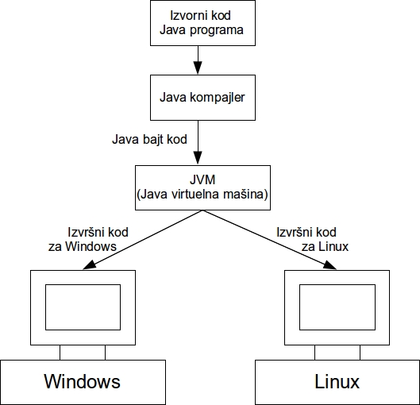
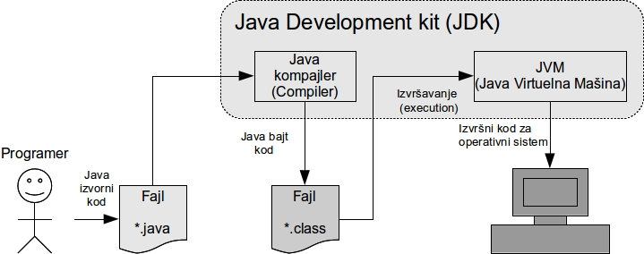

# Predavanje 1

	1 Java osnovne informacije
	2.1 Klase
	2.2 Atributi
	2.3 Objekti i main metoda
	2.4 Metode (deo)

# Java - osnovne informacije

 - Java je **objektno-orijentisani (OO) programski jezik** razvijen od strane Sun Microsystems korporacije, a sada je u vlasništvu Oracle korporacije. Ovaj jezik je besplatan za korišćenje i može se preuzeti sa [sajta Oracle korporacije](https://www.oracle.com/java/).
 - Java JRE i JDK

 

- Java je platformski nezavisan jezik

 

- Proces kompajliranja u Javi
- Sintaksne greške

Neki od najpopularnijih IDE za Javu su:

- [Eclipse](http://www.eclipse.org/) (besplatan)
- [Apache NetBeans](https://netbeans.apache.org/) (besplatan)
- [IntelliJ IDEA](https://www.jetbrains.com/idea/) (postoje i komercijalna i besplatna verzija)

Neka od popularnijih besplatnih **onlajn okruženja i editora** za Javu su:

- [Codiva IDE](https://www.codiva.io/)
- [OnlineGDB Online Java Compiler](https://www.onlinegdb.com/online_java_compiler)
- [W3Schools Java Compiler](https://www.w3schools.com/java/java_compiler.asp)
- [Tutorials Point Online Java Compiler](https://www.tutorialspoint.com/compile_java_online.php)
- [Replit IDE](https://replit.com/languages/java10) (nije besplatan, ali postoji i besplatna verzija)

## IntelliJ IDEA okruženje za razvoj programa

- IntelliJ IDEA GUI objašnjenje delova grafičkog interfejsa
- IntelliJ IDEA prozori
- Pravljenje projekta, struktura IntelliJ IDEA projekta

# Zadatak 1

Napraviti klasu **Osoba** u paketu **dvocas1_utorak.zadatak1** koja ima: **(klasa - ideja i deklaracija, paket)**:

- atribut **ime** koji predstavlja ime osobe (npr. "Pera") **(atribut - ideja i deklaracija, osnovni tipovi u Javi i default vrednosti: double 0.0, int 0, boolean false, char '\u0000' (null znak), String i ostali objekti null)**
- atribut **prezime** koji predstavlja prezime osobe (npr. "Peric"). 
- atribut **pol** koji predstavlja pol osobe (npr. 'M', 'Z'). Postaviti da početna vrednost atribute bude 'N'-nepoznato. **(početna vrednost atributa)**
- Atribut **godinaRodjenja** koji predstavlja godinu rođenja osobe (npr. 1990).
- Atribut **uBraku** koji predstavlja indikator da li je osoba trenutno u braku (true) ili ne (false).

**PROBLEM: Prvi put pišem kod, šta ako pogrešim, šta je ovo crveno? Objasniti sintaksne greške i kako ih IntelliJ IDEA označava.**

**PROBLEM: Hteo bih da unesem opis ili objašnjenje u neki deo koda, ali da se to ne shvati kao sintaksna greška**

- Napisati jednolinijski komentar iznad atributa uBraku koji opisuje taj atribut **(komentari u Javi, jednolinijski komentar)**

- Napisati višelinijski komentar iznad klase Osoba koji opisuje tu klasu **(komentari u Javi, višelinijski komentar)**

Napraviti klasu **TestOsoba** u paketu **dvocas1_utorak.zadatak1** koja ima main metodu u kojoj se prave dva objekta klase Osoba i pune sledećim podacima "Lara", "Peric", 'Z', 1990, false i "Mika", "Mikic", 'M', 1983, true. Ispisati na ekranu sve podatke o obe osobe.**(main metoda, objekat - ideja, deklaracija, inicijalizacija, pozivanje atributa, ispis na ekranu - print i println metode)**

**PROBLEM: Java je case-sensitive jezik, razlikuje velika i mala slova. Kako znati da li je naziv klase, atributa i td. napisan velikim ili malim slovima da bi se pozvao kako treba? Objasniti camel case i [Java naming conventions](https://www.oracle.com/java/technologies/javase/codeconventions-namingconventions.html)** 

**PROBLEM: Kada na ekranu ispisujemo sve podatke o osobi, mnogo koda se ponavlja. Uvođenje metoda i njihova svrha.** 

U klasu **Osoba** dodati sledeće metode:

- metodu **ispisi** koja na ekranu ispisuje sve podatke o osobi.**(metode - deklaracija i telo metode, pristup atributima iz metode)**

- metodu **izracunajStarost** koja kao parametar dobija trenutnu kalendarsku godinu (npr. 2022) i vraća kao povratnu vrednost koliko godina starosti ima osoba. **(parametri metode i povratna vrednost metode)**

Izmeniti kod u main metodi klase **TestOsoba** tako da se poziva metoda ispisi svaki put kada treba ispisati sve podatke o ove dve osobe, i izračunati i ispisati na ekranu starost obe osobe - pozivajući odgovarajuće metode.**(pozivanje metoda, argumenti metode, lokalne promenljive i atributi - vidljivost)**

**PROBLEM: Kako da znam koje sve atribute i metode ima klasa tj. koje imaju parametre, da li nešto vraćaju i sl.? Objasniti IntelliJ IDEA autocompletion, i kako izlazi javadoc dokumentacija kada se iskuca. Pokazati dokumentaciju klase java.lang.String na Oracle sajtu i u IntelliJ IDEA editoru.**

**PROBLEM: Kako da znam gde je moj projekat i gde su njegovi fajlovi? IntelliJ IDEA struktura projekta po fajlovima.**

# Zadatak 2 (opciono)

Napraviti program koji omogućava rad servisa za tehnički pregled automobila. Potrebno je omogućiti pamćenje sledećih podataka za svaki automobil: ime i prezime vlasnika, marka i model automobila, registracija, godina proizvodnje, snaga motora u kilovatima (npr. 22.5) i da li je prošao tehnički pregled.

Osim toga, trebalo bi omogućiti i da se lako vrši ispis na ekranu svih podataka o automobilu, kao i izračunavanje cene tehničkog pregleda. Osnovna cena tehničkog pregleda je 4500 dinara, ali se umanjuje za po 100 dinara za svaku godinu starosti automobila. Na primer, ako je automobil star 10 godina, cena tehničkog pregleda će biti 4500 - 10*100 = 4500 - 1000 = 3500 dinara. 