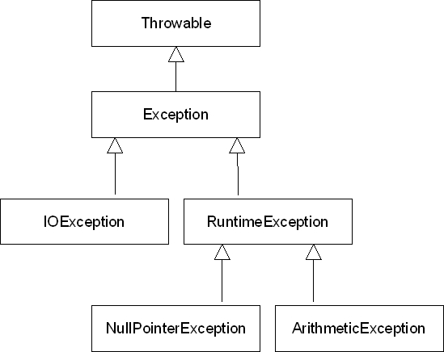
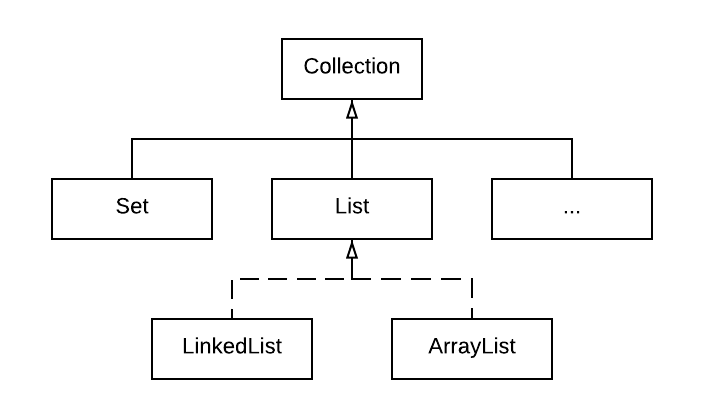

# Predavanje 9

	11.1 Klasa ArrayList
	11.2 Klasa LinkedList
	12 Izuzeci

# Zadatak 1

Napraviti javnu klasu **Film** u paketu **dvocas9.zadatak1** koja ima:

- privatni atribut **naslov** koji sadrži naslov filma.
- privatni atribut **reziser** koji sadrži ime i prezime režisera.
- privatni atribut **godina** koji predstavlja godinu kad je film prvi put prikazan (npr. 2001).

- javne **get i set metode** za ove atibute. Nedozvoljene vrednosti za naslov i režisera su null i prazni String-ovi, a godina mora biti veća od 1892. U slučaju unosa ovih nedozvoljenih vrednosti, potrebno je ispisati poruku greške na ekranu.
- redefinisanu javnu **toString** metodu koja vraća String sa svim podacima o Filmu.
- redefinisanu javnu **equals** metodu koja poredi dva objekta klase Film i vraća true ako su im isti naslov i godina, a false ako nisu.

**Problem: kako prijaviti greške u programu, šta je sve potrebno od podataka da se prijavi?**

Napraviti javnu klasu **TestFilm** u paketu **dvocas9.zadatak1.test** u čijoj main metodi se pravi jedan objekat klase Film. Ispisati na ekranu koliko znakova ima naslov filma.**(Mehanizam izuzetaka u Javi - exceptions, NullPointerException, stack trace, prekidanje izvršavanja programa, ugrađeni izuzeci)** 

**Problem: Program se prekida ako se pojavi izuzetak, kako to sprečiti? Kako "obraditi" izuzetak?**

Izmeniti kod klase **TestFilm** tako što će se u objekat klase Film uneti sledeći podaci: "Blade Runner 2049", "Denis Villeneuve" i 2017. Ispisati na ekranu 25. znak iz naslova filma.**(StringIndexOutOfBoundsException, hvatanje izuzetaka try-catch blok)**

**Problem: Kako iskoristiti mehanizam izuzetaka za prijavljivanje grešaka iz našeg koda? Trenutno, naš kod samo ispisuje poruku greške na ekranu - nema stack-trace-a, a poruka se možda i ne vidi ako aplikacija ima grafički korisnički interfejs (graphical user interface - GUI).**

Izmeniti kod klase **Film** tako da se u svim set metodama umesto ispisa poruke greške na ekranu baci izuzetak sa istom tom porukom. Bacati **NullPointerException** za null vrednosti a **RuntimeException** za ostale nedozvoljene vrednosti. Promeniti onda da se u metodi setNaslov baca PROVERAVANI izuzetak.**(bacanje izuzetaka - throw naredba, proveravani i neproveravani izuzeci, hijerarhija klasa izuzetaka)**

**Problem: kako napraviti da postoji enciklopedija filmova koja ima više filmova, ali se ne zna koliko. Zna se da će se non-stop ažurirati, dodavati, pa nizovi nisu dobro rešenje.**

Napraviti javnu klasu **EnciklopedijaFilmova** u paketu **dvocas9.zadatak1** koja ima:

- privatni atribut **filmovi** koji predstavlja **listu** objekata klase Film. Ovu listu treba odmah inicijalizovati kao ArrayList.**(liste u Javi, interfejs List i implementacije ArrayList i LinkedList)**

- javnu metodu **dodajFilm** koja kao parametar dobija objekat klase Film koji je potrebno uneti u listu filmovi i to samo ako u listi ne postoji isti film. Ako u listi postoji isti film, ne unositi ga već baciti izuzetak sa odgovarajućom porukom.**(rad sa listama, metode add i contains)**
- javnu metodu **obrisiFilm** koja kao parametar dobija objekat klase Film koji je potrebno izbrisati iz liste filmovi i to samo ako u listi postoji isti film. Ako u listi ne postoji isti film, ne raditi ništa.**(rad sa listama, metoda remove)**
- javnu metodu **ispisi** koja na ekranu ispisuje sve filmove iz liste filmovi.**(indeksi elemenata liste, prolazak kroz listu element po element, metode size i get, for foreach i iterator verzije metode)**
- javnu metodu **pronadjiFilm** koja kao parametar dobija deo naslova filma i na ekranu ispisuje sve filmove iz liste filmovi koji sadrže taj String kao deo naslova.**(for foreach i iterator verzije metode)**

Izmeniti kod klase **TestFilm** tako da se napravi još jedan objekat klase Film sa podacima: "Blade Runner", "Ridley Scott", 1982. Napraviti objekat klase EnciklopedijaFilmova, uneti oba filma i probati metode ove klase.